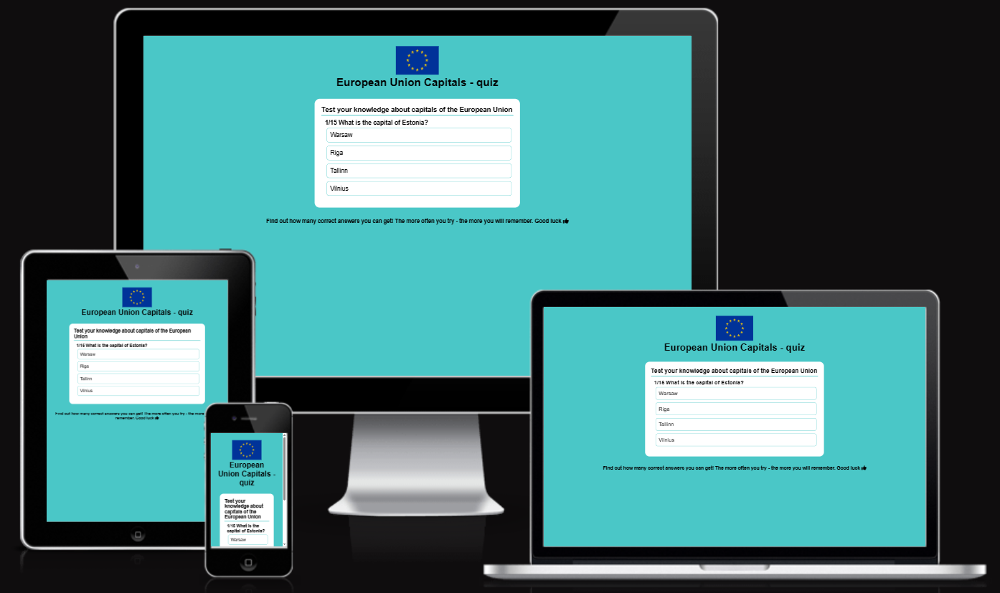
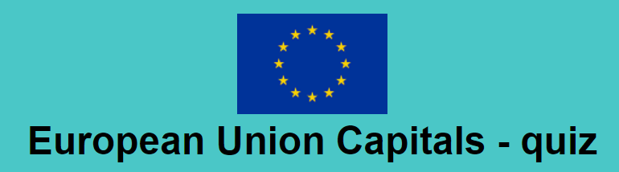
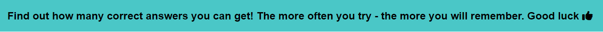
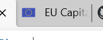
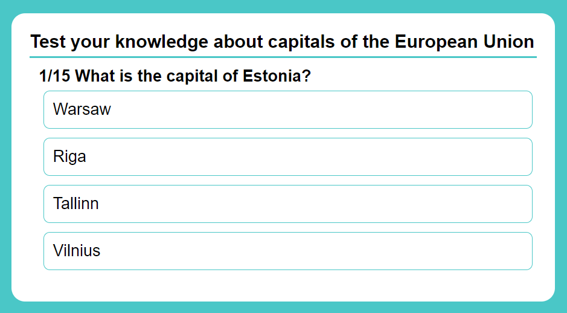
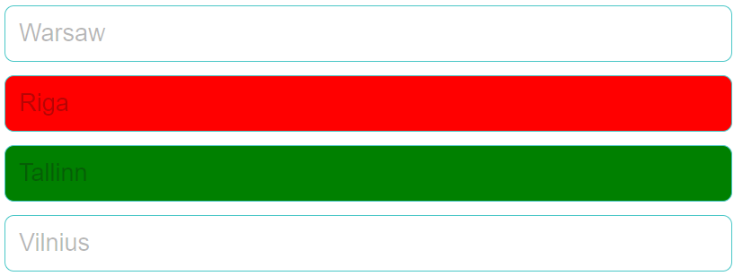
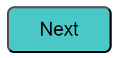
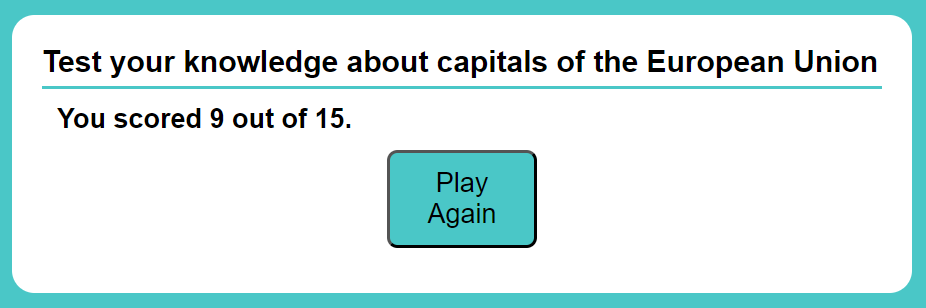
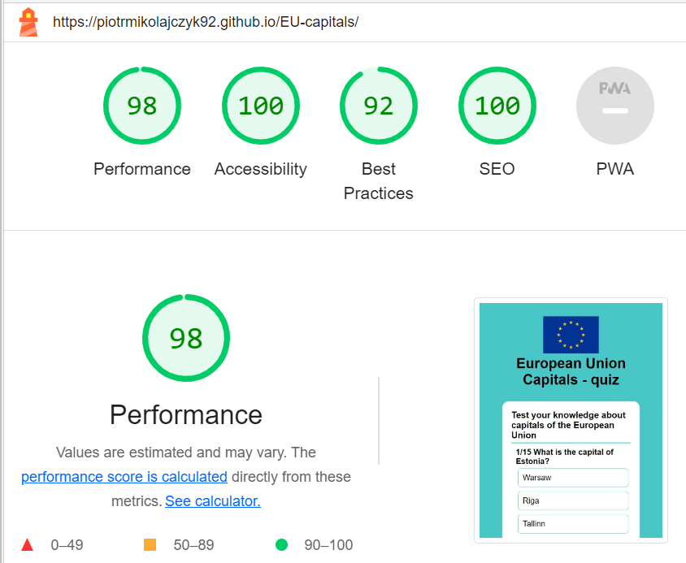

<h1>EU Capitals - Quiz</h1>

European Union Capitals Quiz is a website for users interested in solving quizzes for general knowledge update purpose.

The Quiz is focused on general knowledge about the capitals of members of the European Union, their locations on the map and demography. Users will be able to test their knowledge by answering 15 questions and will be given a feedback after that.

 

 
<h1>Features</h1>
    <ul>
    <h2>Site Wide</h2>
        <li>
        <h2>Header</h2>
            <ul>
                <li>Featured at the top of the page and aligned to the middle.
                </li>
                <li>Clearly shows the main subject of what the Quiz will be about.</li>
            </ul>
             
            
             
        </li>
        <li>
        <h2>Footer</h2>
            <ul>
                <li>This will contain a text content to encourage users to attempt solving the Quiz many times.</li>
                <li>The more times users will undertake this Quiz, the more likely they will memorise the informations asked in questions provided.</li>
            </ul>
             
            
             
        </li>
        <li>
        <h2>Favicon</h2>
            <ul>
                <li>A site wide favicon implemented.</li>
                <li>This will provide an image in the the tabs header to allow the user to easily identify the website if they have multiple tabs open.</li>
            </ul>
         
        
         
        </li>
        <li>
        <h2>Quiz Area</h2>
            <ul>
                <li>The main purpose of the Quiz will be displayed on the top</li>
                <li>Below that, question and clickable buttons with possible options will be displayed.</li>
            </ul>
         
        
         
        </li>
    </ul>
    <h2>Answer Buttons</h2>
        <ul>
            <li>There will be 4 clickable buttons for each question displayed for user to choose</li>
            <li>If the user chooses wrong answer it will turn red and the correct answer will be highlighted green and all the answer buttons will be disabled.</li>
            <li>If the user chooses correct answer it will turn green and all the answer buttons will be disabled.</li>
         
        
         
        </ul>
    <h2>Next Button</h2>
    <ul>
        <li>Next button is initially hidden.</li>
        <li>It will display once the user clicks on any answer button provided to allow to skip to the next question</li>
     
    
     
    </ul>
    <h2>Feedback</h2>
    <ul>
        <li>Feedback will be displayed to the user after answering all 15 questions.</li>
        <li>The next button will then change its text to "Play Again" and allow the user to restart the Quiz.</li>
     
    
     
    </ul>
    <h2>Faatures left to implement</h2>
    <ul>
        <li>Add more questions and change quiz mode to display 10 random questions on each Quiz undertaken.</li>
        <li>Add feedback page for users to leave some new questions suggestions to implement in questions set</li>
     
    </ul>
<h1>Technologies</h1>
    <ul>
        <li>HTML
            <ul>
                <li>
                    The structure of the Website was developed using HTML as the main language.
                </li>
            </ul>
        </li>
        <li>CSS
            <ul>
                <li>
                    The Website was styled using custom CSS in an external file.
                </li>
            </ul>
        </li>
        <li>JavaScript
            <ul>
                <li>
                    The game play logic was created using JavaScript in an external file.
                </li>
            </ul>
        </li>
        <li>GitHub
            <ul>
                <li>
                    Source code is hosted on GitHub
                </li>
            </ul>
        </li>
        <li>Font Awesome
            <ul>
                <li>
                    Icons obtained from <a href="https://fontawesome.com/" target="_blank">https://fontawesome.com/</a> were used as the Social media links in the footer section.
                </li>
            </ul>
        </li>
        <li>Favicon.io
            <ul>
                <li>
                    Favicon files were created at <a href="https://favicon.io/favicon-converter/" target="_blank">https://favicon.io/favicon-converter/</a>
                </li>
            </ul>
        </li>
    </ul>
<h1>Testing</h1>
    <ul>
        <li>I tested that this website works on different browsers: Google Chrome, Microsoft Edge.</li>
        <li>I confirmed that this website is responsive, looks good and functions on all standard screen sizes using the devtools device toolbar.</li>
        <li>I confirmed that the header, quiz area, footer and buttons are all readable and easy to understand.</li>
        <li>Website is responsive on all screen sizes and no images are pixelated or stretched. No horizontal scroll is present. No elements overlap. Steps to test:
            <ol>
            <li>Open browser and navigate to <a href="https://piotrmikolajczyk92.github.io/EU-capitals/" target="_blank">EU Capitals</a></li>
            <li>Open the developer tools (right click and inspect).</li>
            <li>Click and drag the responsive window to minimum and maximum width</li>
            </ol></li>
    </ul>
<h1>Fixed Bugs</h1>
    <ul>
        <li>While manual testing of this Quiz I noticed that when feedback is displayed and if I clicked "Play Again" button, the Quiz restarts but the text inside this button stays as "Play Again" instead of "Next".</li>
        <li>To fix this I changed nextButton inner HTML in startQuiz function.</li>
    </ul>
<h1>Validator Testing</h1>
    <ul>
        <li>HTML
            <ul>
                <li>
                    No errors were returned when passing through the official W3C validator.
                </li>
            </ul>
        </li>
        <li>CSS
            <ul>
                <li>
                    No errors were found when passing through the official (Jigsaw) validator.
                </li>
            </ul>
        </li>
        <li>JavaScript
            <ul>
                <li>
                    No errors were found when passing through the official Jshint validator.
                </li>
            </ul>
        </li>
        <li>Accesibility
            <ul>
                <li>
                    I confirmed that the colors and fonts chosen are easy to read and accessible by running it through lighthouse in devtools.
                </li>
                 
                
                 
            </ul>
        </li>
    </ul>
<h1>Deployment</h1>
    <ul>
        <li>The site was deployed to GitHub pages. The steps to deploy are as follows:
            <ul>
                <li>In the GitHub repository, navigate to the Settings tab.</li>
                <li>From the source section drop-down menu, Select the Master Branch.</li>
                <li>Once the master branch has been selected, the page provided the link to the completed website.</li>
            </ul>
        </li>
    </ul>
    The live link can be found here - <a href="https://piotrmikolajczyk92.github.io/EU-capitals/" target="_blank">EU Capitals - Quiz</a>
<h1>Credits</h1>
    <ul>
        <li>Tutorial on how to create a quiz app using JavaScript can be found <a href="https://www.youtube.com/watch?v=PBcqGxrr9g8&t" target="_blank">here</a></li>
    </ul>
</body>
</html>
